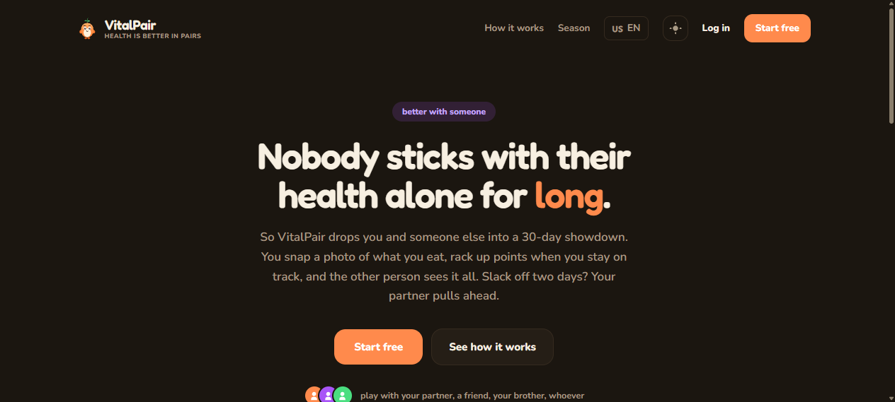
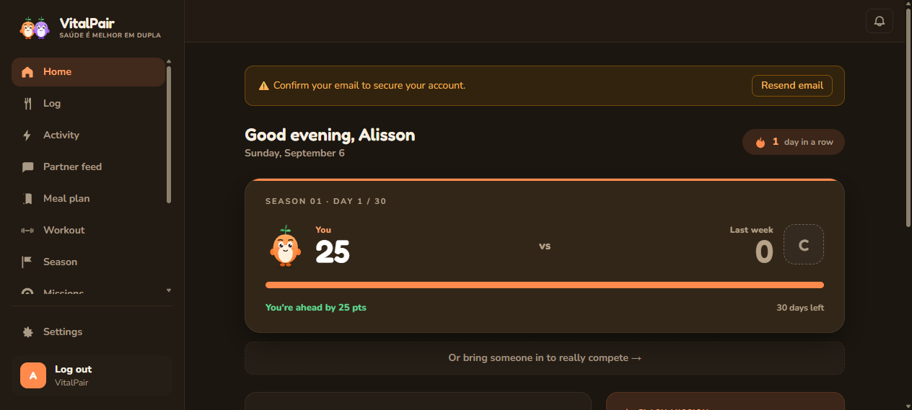
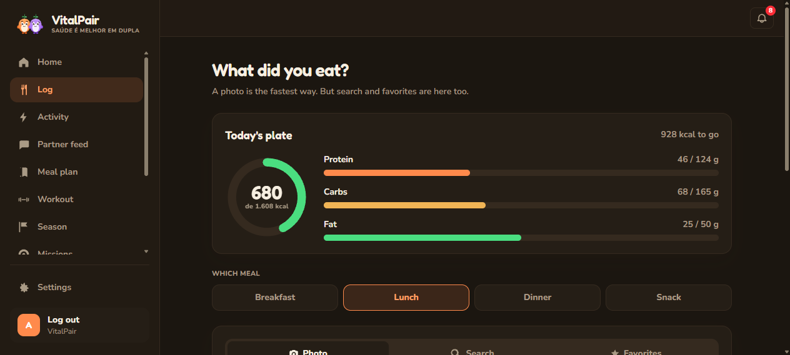
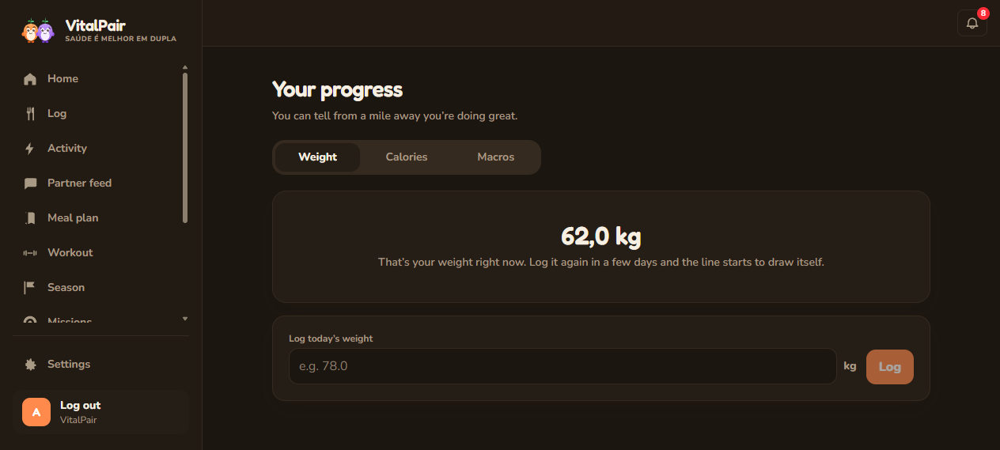

# VitalPair

[](https://github.com/AlissonSouto7/vitalpair/actions/workflows/ci.yml)
[](https://github.com/AlissonSouto7/vitalpair/actions/workflows/codeql.yml)
[](LICENSE)

Health and fitness for two. Nobody sticks with their health alone for long, so
VitalPair puts you and one other person, a partner, a friend, a sibling, into a
thirty-day showdown. You photograph what you eat, log what you do, score points
for staying on track, and the other person sees the scoreboard move. Slack off
for two days and they pull ahead.

Two people with opposite goals can compete on the same terms: one cutting, one
bulking, each measured against their own targets.

<p align="center">
  
  
</p>
<p align="center">
  
  
</p>

## Seeing it run

There is a staging environment at **<https://staging.vitalpair.app>**, on a
single Oracle free-tier ARM machine: the application, Postgres, Redis, an nginx
edge with a real certificate, and Prometheus with Grafana beside it. Signing up
works, and so does everything above except the AI features, which belong to a
paid plan that nobody can buy yet.

It is staging rather than production on purpose. The product has no users, and
the version that goes live is a decision rather than a consequence of a merge:
a push to `main` deploys there on its own, while production waits for somebody
to approve a tagged release.

## What it does

- **Log meals** by photo (a vision model identifies the foods and estimates
  portions and macros), by searching Open Food Facts, by barcode, or by hand.
- **Log activity**: steps, runs, rides, workouts, with calories computed or
  estimated.
- **Targets that follow you**: basal and total daily energy (Mifflin-St Jeor)
  and a macro split derived from your goal, recomputed whenever the profile
  changes.
- **AI plans**: a week of meals and a week of workouts generated from your own
  targets, with single-meal swaps and tickable exercises.
- **Points, streaks, badges** and a weekly scoreboard between the two of you.
- **Seasons**: thirty days, a stake you agree on, a per-day chart and a history
  of who won.
- **A shared feed** with reactions, and a private toggle for a meal you would
  rather not show.
- **Missions**: a daily flash challenge for the pair and weekly targets counted
  live from what you actually logged.
- Four interface languages (Portuguese, English, Spanish, French), dark and
  light themes, e-mail verification, password reset, Google sign-in.

## Stack

| Layer                        | Technology                                                                                                                     |
| ---------------------------- | ------------------------------------------------------------------------------------------------------------------------------ |
| Backend                      | Java 17, Spring Boot 3.5, Spring Security, Spring Data JPA, Flyway, MapStruct, springdoc-openapi                               |
| Data                         | PostgreSQL 16, Redis 7 (refresh tokens, rate limits)                                                                           |
| Resilience and observability | resilience4j circuit breakers, ShedLock, Micrometer with Prometheus, structured JSON logs (ECS), request correlation ids       |
| External APIs                | Anthropic (photo analysis, plan generation), Open Food Facts                                                                   |
| Frontend                     | React 19, TypeScript, Vite, Tailwind CSS 4, TanStack Query, react-hook-form with zod, react-i18next                            |
| Tests                        | JUnit 5, Mockito, Testcontainers, WireMock with captured real responses, ArchUnit, Vitest, Playwright                          |
| Quality gates                | Spotless, Checkstyle, JaCoCo, CodeQL, Dependabot, Husky with commitlint                                                        |
| Deployment                   | Multi-stage Docker images, Docker Compose with an edge proxy per machine and a stack per environment, nginx with Let's Encrypt |

## Architecture in one paragraph

The backend is hexagonal and organised by feature: `nutrition`, `pair`,
`season` and so on each own their `domain`, `application` and `infrastructure`
layers, and dependencies point inwards only. Features talk to each other
through published ports or domain events, never through each other's services
or tables. A pair is a tenant; every business table carries `tenant_id`, and an
integration test builds two pairs with distinguishable data and checks that no
endpoint leaks one into the other. These rules are enforced by ArchUnit, not by
convention. The full picture is in [docs/ARCHITECTURE.md](docs/ARCHITECTURE.md);
the reasons behind the decisions are in [docs/adr/](docs/adr/).

## Running it locally

Requires JDK 17, Node 22 or newer, and Docker.

```bash
cp .env.example .env                                        # then fill in the values
docker compose up -d                                        # Postgres 16, Redis 7, Mailpit
SPRING_DOCKER_COMPOSE_ENABLED=false ./mvnw spring-boot:run  # API on http://localhost:8081
cd frontend && npm ci && npm run dev                        # app on http://localhost:5173
```

The frontend calls `/api` on its own origin and Vite proxies it to the backend,
which is what the `SameSite=Strict` refresh cookie needs.

| Address                                     | What it is                                                                                                                                |
| ------------------------------------------- | ----------------------------------------------------------------------------------------------------------------------------------------- |
| http://localhost:5173                       | The app                                                                                                                                   |
| http://localhost:8081/swagger-ui/index.html | Interactive API documentation, one section per feature. Log in there, copy the `accessToken`, click **Authorize**. Disabled in production |
| http://localhost:9090/actuator/health       | Health, on a management port that production never publishes                                                                              |
| http://localhost:9090/actuator/prometheus   | Metrics: JVM, HTTP, circuit breakers, AI calls by kind and outcome                                                                        |
| http://localhost:8025                       | Mailpit, the inbox for the e-mails the app "sent"                                                                                         |

With `MAIL_ENABLED=false` (the development default) verification and reset
e-mails go to Mailpit instead of the internet. AI features answer 503 until
`ANTHROPIC_API_KEY` is set.

## Tests

| Command                      | What runs                                                                                                                                          | Needs               |
| ---------------------------- | -------------------------------------------------------------------------------------------------------------------------------------------------- | ------------------- |
| `./mvnw test`                | 90 unit tests                                                                                                                                      | nothing             |
| `./mvnw verify`              | everything: unit, 158 integration tests against real Postgres, Redis and SMTP in containers, formatting, style, architecture rules, coverage floor | Docker              |
| `cd frontend && npm test`    | 170 frontend tests, including translation parity across the four languages                                                                         | nothing             |
| `cd frontend && npm run e2e` | 20 browser tests in a real Chromium against the production build                                                                                   | the backend running |

Measured on 2026-09-09: line coverage 88%, branch coverage 62%, with a build
floor of 80 / 50 that only moves up. Every test added since phase 7 was proved
non-vacuous by breaking the code on purpose and watching it fail.

External APIs are never called in tests. Anthropic and Open Food Facts are
replayed by WireMock from responses captured from the real services, so a
change in their shape shows up as a fixture to re-record, not as a surprise in
production.

## Security, in short

Access tokens are fifteen-minute JWTs held in memory; refresh tokens are opaque,
single-use, rotated in families, and delivered only as an `HttpOnly`
`SameSite=Strict` cookie, so a replay revokes the whole session. Every
authentication and AI endpoint is rate limited in Redis. Secrets have no
defaults: production refuses to start without a real `JWT_SECRET`. Every
response error carries a `requestId` that finds its log lines. The full
checklist that every change goes through is in [CLAUDE.md](CLAUDE.md); the
findings per feature, fixed and open, are in [docs/features/](docs/features/).

## Documentation

| Document                                     | What it holds                                                                         |
| -------------------------------------------- | ------------------------------------------------------------------------------------- |
| [docs/ARCHITECTURE.md](docs/ARCHITECTURE.md) | How the code is organised and why                                                     |
| [docs/features/](docs/features/)             | One living document per feature: rules, security findings, tests, what is not covered |
| [docs/adr/](docs/adr/)                       | Architecture decision records                                                         |
| [CLAUDE.md](CLAUDE.md)                       | Engineering rules and the definition of done                                          |
| [CONTRIBUTING.md](CONTRIBUTING.md)           | Branching, commits, pull requests, migrations, i18n                                   |
| [SECURITY.md](SECURITY.md)                   | How to report a vulnerability                                                         |
| [deploy/README.md](deploy/README.md)         | Running it on a server: TLS, backups, deploy with rollback                            |
| [docs/design/](docs/design/)                 | Mockups, the colour law, voice and tone                                               |

## Workflow

GitHub Flow. `main` is protected and always releasable; every change comes
through a short branch and a pull request, merged once the three CI jobs
(backend, frontend, browser) are green. Commits follow Conventional Commits and
are checked by a git hook. Releases are cut by release-please from the commit
history: merging its pull request tags the version and updates the changelog.

## Licence

[Business Source License 1.1](LICENSE). Anyone may read, run and learn from the
code; offering it as a hosted service to others is reserved until each version's
change date, four years after release, when it becomes Apache 2.0.
